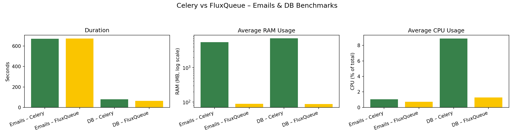
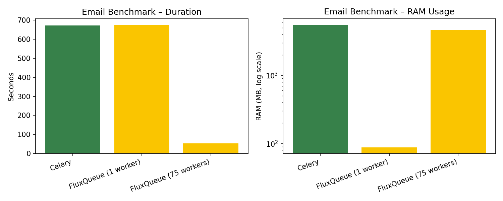
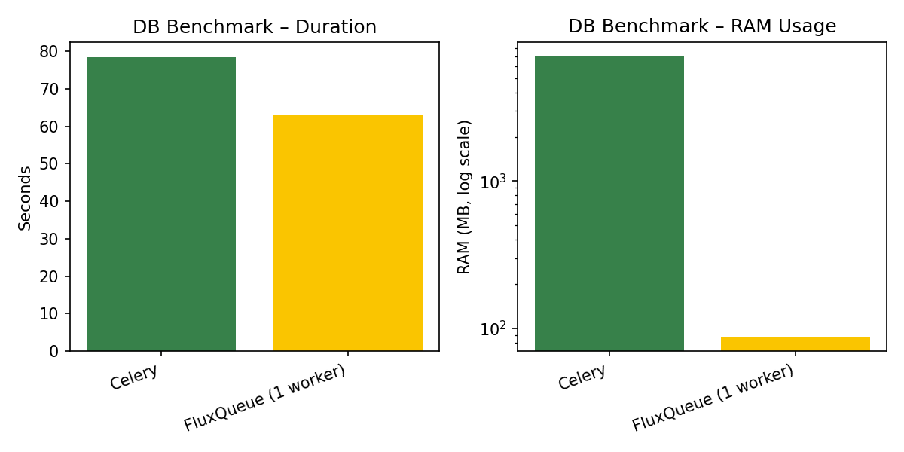

# FluxQueue Benchmarks

Performance benchmarks comparing FluxQueue and Celery across different workloads on a FastAPI server.

## Charts

### Email overview

### DB overview

## Tested scenarios

- [x] Emails
- [x] DB Queries
- [ ] API Calling
- ...

## Test machine

- **CPU**: 12th Gen Intel Core i5-12500H (16 logical CPUs)
- **Memory**: 16 GB RAM
- **OS**: Linux (Arch), kernel 6.18.7-arch1-1 (x86_64)

## Test Configuration

Concurrency refers to the `concurrency` argument for both `fluxqueue` and `celery`, but they have different meanings internally. For `celery`, it also means the number of Python processes it's going to spawn. For `fluxqueue`, it means the number of `tokio` async threads within a single process which are called `executors`.

## Email Processing Results

All benchmarks process 10,000 requests on a FastAPI server with 1 `uvicorn` worker, each enqueues a task that sends an email on a local SMTP server. Email has html as body and its total size is about 4.4kb and both Celery and FluxQueue takes about 5 seconds to finish the task. The tasks are done asynchronously.

#### Celery

- **Total Requests**: 10,000
- **Concurrency**: 75
- **Processes**: 75
- **Duration**: 672.939 seconds
- **Average RAM Usage**: 5,487.89 MB
- **Average CPU Usage**: 1.05% (of total 16-core CPU)

#### FluxQueue (Single Worker)

- **Total Requests**: 10,000
- **Concurrency**: 75 per process
- **Processes**: 1
- **Duration**: 673.882 seconds
- **Average RAM Usage**: 88.27 MB
- **Average CPU Usage**: 0.72% (of total 16-core CPU)

#### FluxQueue (75 Workers)

- **Total Requests**: 10,000
- **Concurrency**: 75 per process
- **Processes**: 75
- **Duration**: 52.856 seconds
- **Average RAM Usage**: 4,615.41 MB
- **Average CPU Usage**: 4.84% (of total 16-core CPU)

### Summary (Emails)

FluxQueue with a single worker (process) matches Celery's performance while using significantly less resources (~88 MB vs 5,488 MB RAM, ~0.7% vs 1.05% CPU). When scaled to 75 workers, FluxQueue completes the same workload ~12.7x faster than Celery (~52.9 seconds vs 672.9 seconds) with similar RAM usage but moderately higher CPU utilization (~4.8% vs 1.05%).

Key points:

- FluxQueue matches Celery’s throughput with ~98% less memory in single-worker mode.
- Under equal RAM constraints, FluxQueue scales horizontally and completes the same workload ~12.7x faster than Celery.
- FluxQueue achieves ~15x higher throughput per GB of RAM compared to Celery.
- Celery is memory-heavy, while FluxQueue achieves similar or better throughput with far less memory and CPU usage for email workloads.

## Database Query Results

All benchmarks process 10,000 HTTP requests on a FastAPI server with 2 `uvicorn` workers. Each request enqueues a task that performs two `SELECT` queries on a 1M-row table, does some simple calculations, and inserts the result into another table in a Postgres database. Database connections and queries are done asynchronously using `asyncpg` library.

#### Celery (1 worker, 75 processes)

- **Total Requests**: 10,000
- **Uvicorn Workers**: 2
- **Celery Workers**: 1
- **Processes (concurrency)**: 75
- **Duration**: 78.547 seconds
- **Average RAM Usage**: 7,046.54 MB
- **Average CPU Usage**: 8.88% (0.56% per core, 16 cores)

#### FluxQueue (1 worker, 75 internal executors)

- **Total Requests**: 10,000
- **Uvicorn Workers**: 2
- **FluxQueue Workers**: 1
- **Processes**: 1
- **Internal Executors (concurrency)**: 75
- **Duration**: 63.110 seconds
- **Average RAM Usage**: 87.41 MB
- **Average CPU Usage**: 1.27% (0.08% per core, 16 cores)

### Summary (DB queries)

For database-heavy workloads, FluxQueue completes the same workload while using far fewer resources. In this benchmark, FluxQueue finishes in 63.1 seconds and Celery in 78.5 seconds, with FluxQueue using ~80x less RAM (≈87 MB vs ≈7,047 MB) and about 7x less CPU (1.27% vs 8.88% total CPU).

Key points:

- Celery achieves good throughput but with very high RAM usage for DB-heavy workloads.
- FluxQueue trades a small amount of scheduling overhead for dramatically lower RAM and CPU usage.
- When memory and CPU are constrained, FluxQueue can handle the same DB workload more efficiently than Celery.

## Overall Takeaways

- For both email and DB workloads, FluxQueue completes the same tasks in comparable wall-clock time while using significantly less memory and CPU than Celery.
- Because a single FluxQueue worker uses much less memory than a single Celery worker, the same total memory budget that Celery uses for its processes could instead be used to run many more FluxQueue workers. In that regime, FluxQueue would be able to complete the workload much faster than Celery at similar or lower total resource usage.
